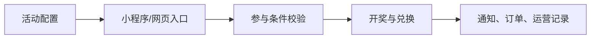

# 009 微信活动运营平台 | WeChat Campaign

> 让抽奖、兑换、参与条件、通知和后台运营在一个系统里闭环。
>
> **English:** A practical, runnable project with a documented workflow for the problem described above.

## 项目展示 / Demo

## 解决什么问题 / Problem

解决活动规则、中奖结果、兑换码和运营审核分散管理的问题。

**English:** This project addresses the problem above with a reproducible local workflow.

## 有什么用 / Use

运营人员创建活动并配置规则，用户从网页或小程序参与，系统完成开奖、通知、兑换和记录。

**English:** Run the workflow locally, inspect the output, and extend the project from the provided source.

## 高光亮点 / Highlights

- 定时开奖、人数开奖、即抽即中和手动补开奖
- 区域、问卷、审核、助力等参与条件
- 运营后台、评论审核、合作申请和结果查询
- Docker/Node.js 本地部署与 API 测试

## 技术名词 / Tech

`Node.js · Express · WeChat Mini Program · MySQL/SQLite · Docker`

## 从 ZIP 开始复现 / Reproduce from ZIP

1. 下载 ZIP 并解压。
2. 复制 ...env.example 为 ...env，填写本地数据库和平台配置。
3. 执行 npm install。
4. 执行 npm start 或按 docker-compose.yml 启动。
5. 微信小程序导入 miniprogram 目录，后台入口按 README 打开。

**Expected result:** 启动后可创建测试活动、模拟参与和查看开奖记录；生产密钥只通过环境变量注入。

## 目录提示 / Notes

- 先阅读本 README，再按项目内更详细的中文/英文文档补充配置。
- 不要把真实密码、Token、数据库业务数据和本机运行结果提交回仓库。
- 下载 ZIP 后的第一次运行应使用测试数据或示例图片，确认链路正常后再接入自己的环境。

[English documentation](README.en.md)
